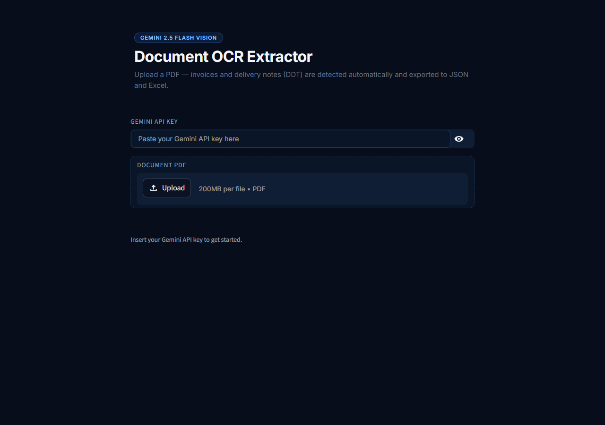

# Document OCR Extractor

> AI-powered web app that reads **invoices** and **delivery notes (DDT)** from PDF files and exports structured data to JSON and Excel — in seconds.




---

## What it does

Upload any PDF invoice or Italian DDT (*Documento di Trasporto*) — the app automatically:

1. **Detects** the document type (invoice vs. delivery note)
2. **Extracts** all relevant fields using Gemini 2.5 Flash Vision
3. **Displays** results in a clean, structured UI
4. **Exports** to JSON and multi-sheet Excel with one click

No templates. No regex. Works on scanned PDFs, digital PDFs, and any language.

---

## Supported documents

| Type | Detected as | Fields extracted |
|------|-------------|-----------------|
| Invoice / Fattura | `invoice` | Number, date, vendor, client, VAT, line items, subtotal, VAT amount, total, currency |
| Delivery Note / DDT | `ddt` | Number, date, sender, recipient, carrier, transport reason, port, goods table, total weight |
| Unknown | `unknown` | Raw summary |

---

## Tech stack

| Library | Role |
|---------|------|
| `PyMuPDF (fitz)` | Opens PDF and renders pages as PNG images (2× zoom for quality) |
| `google-generativeai` | Gemini API client |
| `Gemini 2.5 Flash` | Vision model — reads document and returns structured JSON |
| `Streamlit` | Interactive web UI |
| `pandas` | DataFrame handling and table display |
| `openpyxl` | Multi-sheet Excel export |
| `Pillow` | PIL image handling |

---

## Quick start

### 1. Clone the repository
```bash
git clone https://github.com/YOUR_USERNAME/document-ocr-extractor.git
cd document-ocr-extractor
```

### 2. Install dependencies
```bash
pip install -r requirements.txt
```

### 3. Get a Gemini API key
Go to [Google AI Studio](https://aistudio.google.com/app/apikey) and create a free API key.  
Free tier: **1,500 requests/day** with Gemini 2.5 Flash.

### 4. Run the app
```bash
streamlit run app.py
```

Open your browser at `http://localhost:8501`, paste your API key, upload a PDF and click **Extract Document Data**.

---

## Project structure

```
document-ocr-extractor/
├── app.py                    ← Streamlit UI (auto-detects invoice vs DDT)
├── extractor.py              ← Core logic: PDF → image → Gemini → JSON
├── requirements.txt
├── .streamlit/
│   └── config.toml           ← Dark theme
├── sample_output/
│   ├── example_invoice.json  ← Sample invoice output
│   ├── example_invoice.xlsx
│   ├── example_ddt.json      ← Sample DDT output
│   └── example_ddt.xlsx
├── sample_docs/
│   ├── DDT_sample_01.pdf     ← Fictional DDT — electrical materials
│   ├── DDT_sample_02.pdf     ← Fictional DDT — construction materials
│   └── DDT_sample_03.pdf     ← Fictional DDT — IT equipment
└── create_sample_ddt.py      ← Script used to generate sample DDTs
```

---

## Sample output

**Invoice (`example_invoice.json`):**
```json
{
  "document_type": "invoice",
  "invoice_number": "FT/2024/00892",
  "date": "15/10/2024",
  "vendor_name": "TechForniture S.r.l.",
  "vendor_vat": "IT04512378901",
  "client_name": "Studio Commerciale Bianchi",
  "items": [...],
  "subtotal": 1910.0,
  "vat_percentage": 22,
  "vat_amount": 420.2,
  "total": 2330.2,
  "currency": "EUR"
}
```

**DDT (`example_ddt.json`):**
```json
{
  "document_type": "ddt",
  "ddt_number": "DDT/2024/00547",
  "sender_name": "Alfa Distribuzione S.r.l.",
  "recipient_name": "Beta Forniture S.p.A.",
  "carrier": "Trasporti Gamma Srl",
  "transport_reason": "Vendita",
  "goods": [...],
  "total_weight_kg": 329.3
}
```

---

## How it works

```
PDF upload
  └─► PyMuPDF → renders page 1 as PNG (2× zoom)
        └─► Gemini 2.5 Flash Vision
              ├─► detects: "invoice" | "ddt" | "unknown"
              └─► extracts type-specific JSON fields
                    └─► Streamlit UI → display + download
```

The prompt instructs Gemini to return **only valid JSON** with no markdown wrappers.  
A regex cleanup step handles edge cases where the model adds backticks anyway.

---

## Notes

- **API key**: entered at runtime in the UI — never hardcoded or stored
- **Privacy**: the PDF is written to a system temp file and deleted immediately after processing
- **Accuracy**: works best on digital PDFs; scanned documents may require higher DPI input
- **Limits**: Gemini 2.5 Flash free tier = 1,500 requests/day; upgrade for production use
- **Migration**: `google-generativeai` is deprecated — migration to `google-genai` planned

---

## License

MIT — free to use, modify and distribute.

---

*Built by [Concetta Tomaselli](https://github.com/YOUR_USERNAME) — AI Document Automation Developer*
